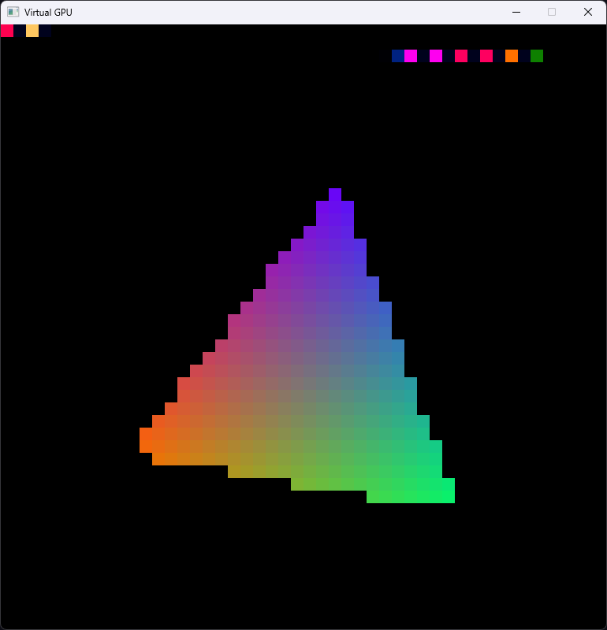
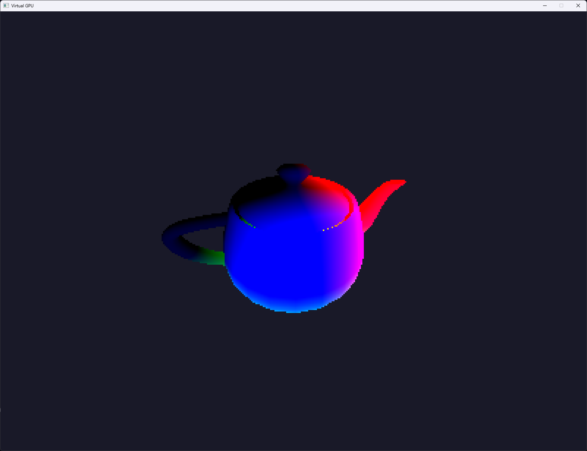

# vgpu

An educational software GPU emulator in Rust

## Goals
- Build a software GPU emulator
- Use tile-based threaded rendering
- Allow the user to define arbitrarily complex vertex & frag shaders in Rust
- Make a robust transmutation pipeline to keep the user-exposed API completely boilerplate free

