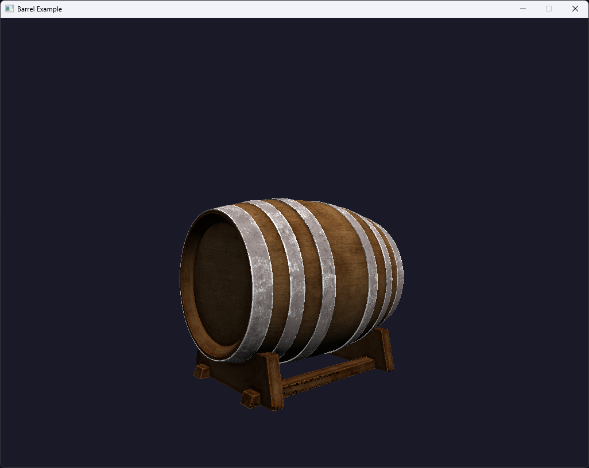

# vgpu

An educational software GPU emulator in Rust

## Goals
- Build a software GPU emulator
- Use tile-based threaded rendering
- Allow the user to define arbitrarily complex vertex & frag shaders in Rust
- Make a robust transmutation pipeline to keep the user-exposed API completely boilerplate free

## Examples
### Teapot

``` Rust
struct Pipeline {
    mvp: glam::Mat4,
}

impl shader::Shader for Pipeline {
    type Vertex = model::Vertex;

    type Interpolant = model::Vertex;

    type Fragment = glam::Vec3;

    type Pixel = u32;

    fn vertex(&self, vertex_in: &Self::Vertex, position_out: &mut glam::Vec4) -> Self::Interpolant {
        *position_out = self.mvp * vertex_in.pos.to_homogeneous();
        *vertex_in
    }

    fn fragment(&self, frag_vertex_in: &Self::Interpolant) -> Self::Fragment {
        frag_vertex_in.nor
    }

    fn pixel(&self, fragment_in: &Self::Fragment) -> Self::Pixel {
        let r = (fragment_in.x * 255.9999) as u8 as u32;
        let g = (fragment_in.y * 255.9999) as u8 as u32;
        let b = (fragment_in.z * 255.9999) as u8 as u32;
        0xffu32 << 24 | r << 16 | g << 8 | b
    }
}
```

### Barrel

``` Rust

```

## Resources
- https://learnopengl.com/
- https://github.com/Hobanghann/HORenderer3.git
- https://github.com/zesterer/euc.git
