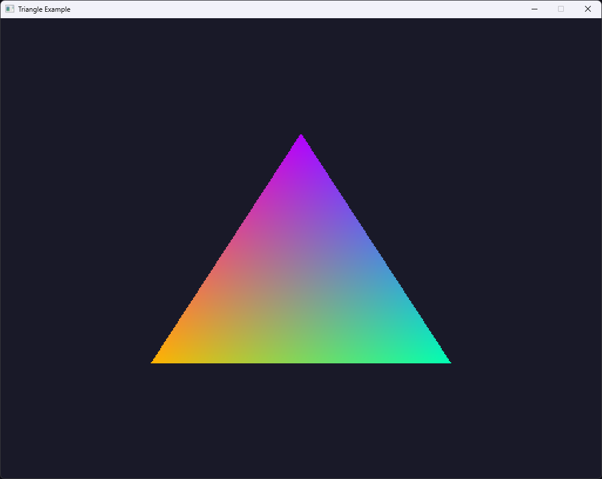
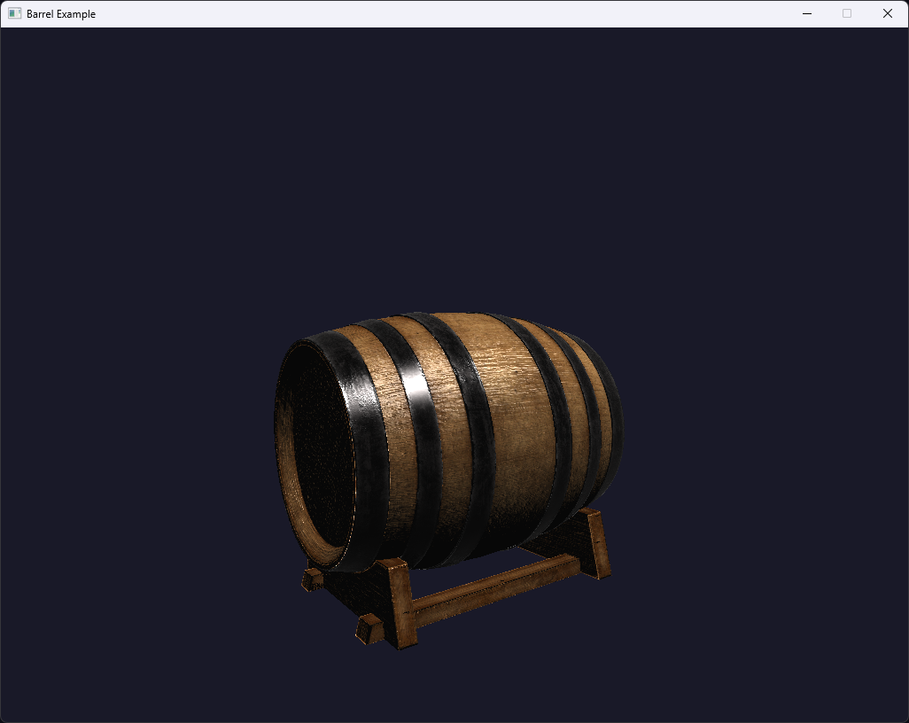

# vgpu

An educational software GPU emulator in Rust

## Goals
- Build a software GPU emulator
- Use tile-based threaded rendering
- Allow the user to define arbitrarily complex vertex & frag shaders in Rust
- Make a robust transmutation pipeline to keep the user-exposed API completely boilerplate free
- Add some sort of anti-aliasing (MSAA likely)
- Add a utils library with things like auto mip-mapped textures

## Examples
### Hello, Triangle


<details>

<summary> Expand for shader programs </summary>

``` Rust
const TRIANGLE: [f32; 18] = [
    // Positions     Colors
    -0.5, -0.5, 0.0,     1.0, 0.7, 0.0,
     0.5, -0.5, 0.0,     0.0, 1.0, 0.7,
     0.0,  0.5, 0.0,     0.7, 0.0, 1.0,
];

struct Pipeline;
impl shader::Shader for Pipeline {
    // (position, color)
    type Vertex = (glam::Vec3, glam::Vec3);

    // Vertex Color
    type Interpolant = glam::Vec3;

    // Fragment Color
    type Fragment = glam::Vec3;

    type Pixel = u32;

    fn vertex(&self, vertex_in: &Self::Vertex, position_out: &mut glam::Vec4) -> Self::Interpolant {
        let (pos, col) = *vertex_in;
        *position_out = pos.to_homogeneous();
        col
    }

    fn fragment(&self, frag_vertex_in: &Self::Interpolant) -> Self::Fragment {
        *frag_vertex_in
    }

    fn pixel(&self, fragment_in: &Self::Fragment) -> Self::Pixel {
        let r = (fragment_in.x * 255.9999) as u8 as u32;
        let g = (fragment_in.y * 255.9999) as u8 as u32;
        let b = (fragment_in.z * 255.9999) as u8 as u32;
        0xffu32 << 24 | r << 16 | g << 8 | b
    }
}
```

</details>

### Teapot


<details>

<summary> Expand for shader programs </summary>

``` Rust
struct Pipeline {
    mvp: glam::Mat4,
}

impl shader::Shader for Pipeline {
    type Vertex = model::Vertex;

    type Interpolant = model::Vertex;

    type Fragment = glam::Vec3;

    type Pixel = u32;

    fn vertex(&self, vertex_in: &Self::Vertex, position_out: &mut glam::Vec4) -> Self::Interpolant {
        *position_out = self.mvp * vertex_in.pos.to_homogeneous();
        *vertex_in
    }

    fn fragment(&self, frag_vertex_in: &Self::Interpolant) -> Self::Fragment {
        frag_vertex_in.nor
    }

    fn pixel(&self, fragment_in: &Self::Fragment) -> Self::Pixel {
        let r = (fragment_in.x * 255.9999) as u8 as u32;
        let g = (fragment_in.y * 255.9999) as u8 as u32;
        let b = (fragment_in.z * 255.9999) as u8 as u32;
        0xffu32 << 24 | r << 16 | g << 8 | b
    }
}
```

</details>

### Barrel


<details>

<summary> Expand for shader programs </summary>

``` Rust
struct Pipeline {
    model_matrix: glam::Mat4,
    mvp_matrix: glam::Mat4,
    normal_matrix: glam::Mat3,

    diffuse: texture::Texture,
    normal: texture::Texture,
    metal: texture::Texture,

    light: glam::Vec3,
    camera: glam::Vec3,
}

impl shader::Shader for Pipeline {
    type Vertex = model::Vertex;

    type Interpolant = model::Vertex;

    type Fragment = glam::Vec3;

    type Pixel = u32;

    fn vertex(&self, vertex_in: &Self::Vertex, position_out: &mut glam::Vec4) -> Self::Interpolant {
        *position_out = self.mvp_matrix * vertex_in.pos.to_homogeneous();

        let mut vertex_out = *vertex_in;
        vertex_out.pos = (self.model_matrix * vertex_in.pos.to_homogeneous()).xyz();
        vertex_out.nor = self.normal_matrix * vertex_out.nor;
        vertex_out
    }

    fn fragment(&self, frag_vertex_in: &Self::Interpolant) -> Self::Fragment {
        let diffuse_map = self.diffuse.sample_bilinear(frag_vertex_in.uv.x, frag_vertex_in.uv.y);
        let normal_map = self.normal.sample_bilinear(frag_vertex_in.uv.x, frag_vertex_in.uv.y);
        let metallic_map = self.metal.sample_bilinear(frag_vertex_in.uv.x, frag_vertex_in.uv.y).x;

        let tangent_normal = normal_map * 2.0 - glam::Vec3::ONE;
        let normal = frag_vertex_in.nor.normalize();
        let tangent = if normal.y.abs() < 0.999 {
            normal.cross(glam::Vec3::Y).normalize()
        }
        else {
            normal.cross(glam::Vec3::X).normalize()
        };
        let bitangent = normal.cross(tangent);
        let world_normal =
            (tangent * tangent_normal.x + bitangent * tangent_normal.y + normal * tangent_normal.z)
                .normalize();

        let light_dir = (self.light - frag_vertex_in.pos).normalize();
        let view_dir = (self.camera - frag_vertex_in.pos).normalize();
        let half_dir = (light_dir + view_dir).normalize();

        let ndl = world_normal.dot(light_dir).max(0.0);
        let ndh = world_normal.dot(half_dir).max(0.0);
        let ndv = world_normal.dot(view_dir).max(0.0);

        let shine = 32.0 + metallic_map * 96.0;
        let specular = ndh.powf(shine);
        let fresnel = (1.0 - ndv).powf(3.0);

        let diffuse_color = diffuse_map * (1.0 - metallic_map);
        let specular_color = glam::Vec3::splat(1.0 - metallic_map * 0.5) + diffuse_map * metallic_map;
        let ambient_color = glam::Vec3::splat(0.025);

        let diffuse_final = diffuse_color * ndl;
        let spec_final = specular_color * specular * (metallic_map * 0.5 + 0.5);
        let rim_final = specular_color * fresnel * 0.15 * metallic_map;

        (ambient_color + diffuse_final + spec_final + rim_final) * 1.15
    }

    fn pixel(&self, fragment_in: &Self::Fragment) -> Self::Pixel {
        let r = (fragment_in.x * 255.9999) as u8 as u32;
        let g = (fragment_in.y * 255.9999) as u8 as u32;
        let b = (fragment_in.z * 255.9999) as u8 as u32;
        0xffu32 << 24 | r << 16 | g << 8 | b
    }

    fn cull_mode() -> shader::CullMode {
        shader::CullMode::Back
    }
}
```

</details>

## Resources
- https://learnopengl.com/
- https://github.com/Hobanghann/HORenderer3.git
- https://github.com/zesterer/euc.git
