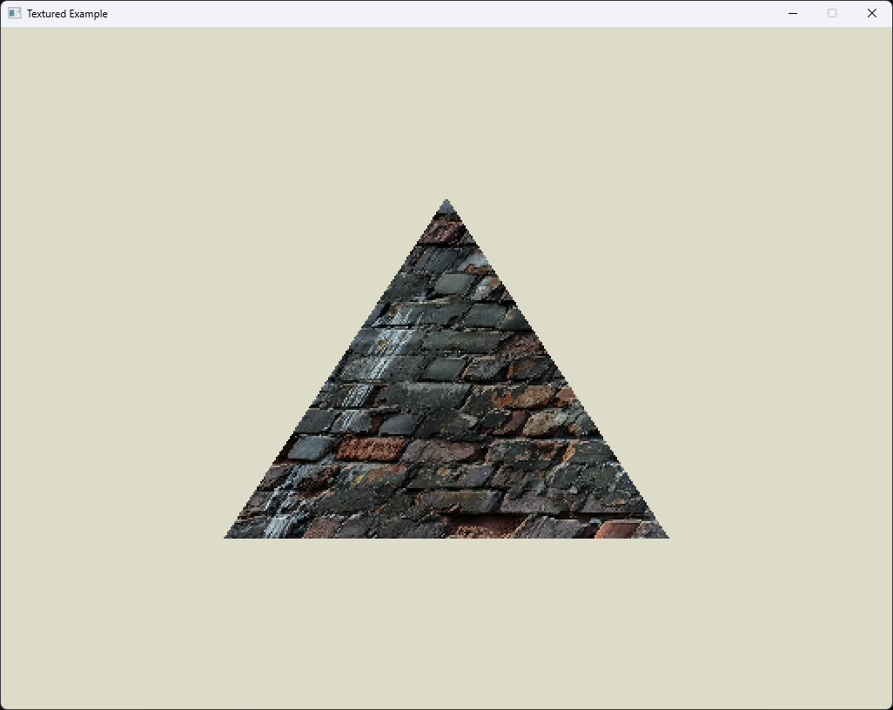
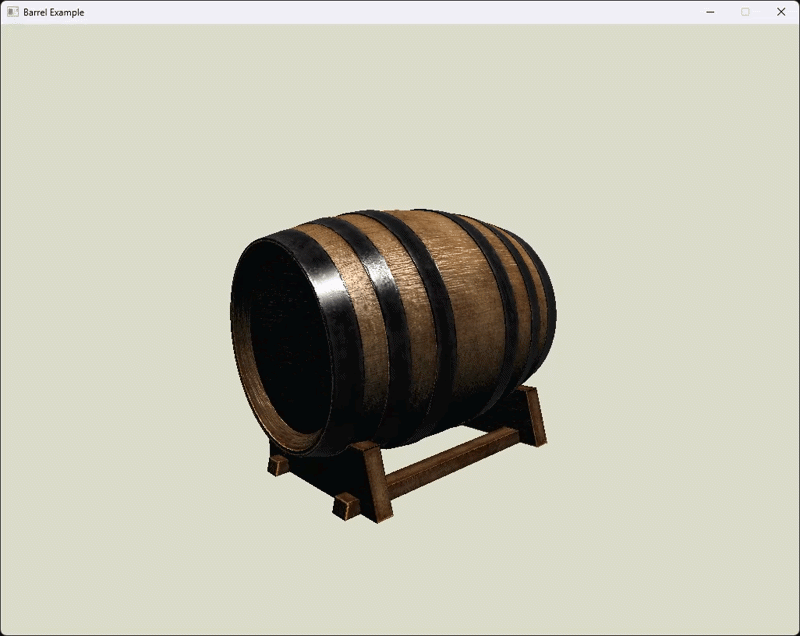
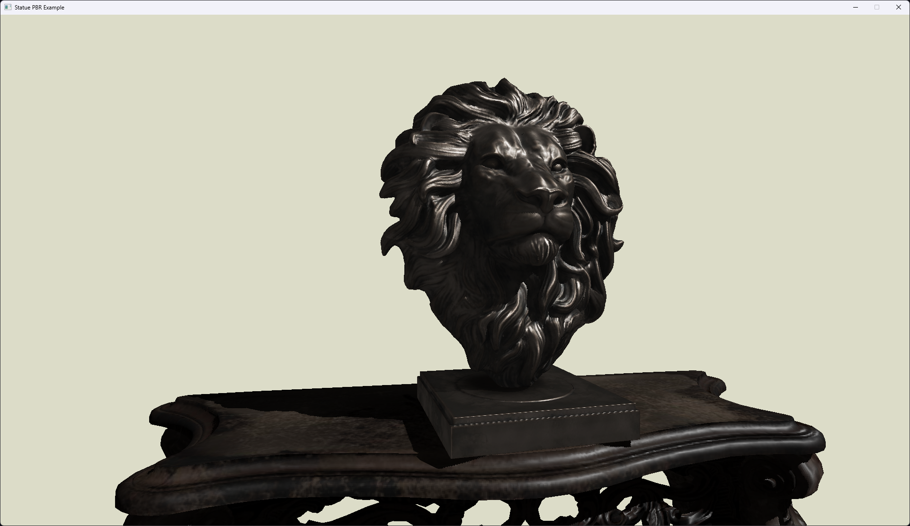

# vgpu

An educational software GPU emulator in Rust

## Examples

<details> 

<summary> Expand to view the "Getting Started" examples </summary>

### Hello, Triangle


<details>

<summary> Expand for shader programs </summary>

``` Rust
const TRIANGLE: [f32; 18] = [
    // Positions     Colors
    -0.5, -0.5, 0.0,     1.0, 0.7, 0.0,
     0.5, -0.5, 0.0,     0.0, 1.0, 0.7,
     0.0,  0.5, 0.0,     0.7, 0.0, 1.0,
];

struct Pipeline;
impl shader::Shader for Pipeline {
    // (position, color)
    type Vertex = (glam::Vec3, glam::Vec3);

    // Vertex Color
    type Interpolant = glam::Vec3;

    // Fragment Color
    type Fragment = glam::Vec3;

    type Pixel = u32;

    fn vertex(&self, vertex_in: &Self::Vertex, position_out: &mut glam::Vec4) -> Self::Interpolant {
        let (pos, col) = *vertex_in;
        *position_out = pos.to_homogeneous();
        col
    }

    fn fragment(&self, frag_vertex_in: &Self::Interpolant) -> Self::Fragment {
        *frag_vertex_in
    }

    fn pixel(&self, fragment_in: &Self::Fragment) -> Self::Pixel {
        let r = (fragment_in.x * 255.9999) as u8 as u32;
        let g = (fragment_in.y * 255.9999) as u8 as u32;
        let b = (fragment_in.z * 255.9999) as u8 as u32;
        0xffu32 << 24 | r << 16 | g << 8 | b
    }
}
```

</details>

### Teapot


<details>

<summary> Expand for shader programs </summary>

``` Rust
struct Pipeline {
    mvp: glam::Mat4,
}

impl shader::Shader for Pipeline {
    type Vertex = model::Vertex;

    type Interpolant = model::Vertex;

    type Fragment = glam::Vec3;

    type Pixel = u32;

    fn vertex(&self, vertex_in: &Self::Vertex, position_out: &mut glam::Vec4) -> Self::Interpolant {
        *position_out = self.mvp * vertex_in.pos.to_homogeneous();
        *vertex_in
    }

    fn fragment(&self, frag_vertex_in: &Self::Interpolant) -> Self::Fragment {
        frag_vertex_in.nor
    }

    fn pixel(&self, fragment_in: &Self::Fragment) -> Self::Pixel {
        let r = (fragment_in.x * 255.9999) as u8 as u32;
        let g = (fragment_in.y * 255.9999) as u8 as u32;
        let b = (fragment_in.z * 255.9999) as u8 as u32;
        0xffu32 << 24 | r << 16 | g << 8 | b
    }
}
```

</details>

### Texture Mapping


<details>

<summary> Expand for shader programs </summary>

``` Rust
const TRIANGLE: [f32; 15] = [
    -0.5, -0.5, 0.0,      0.0,  0.0,
     0.5, -0.5, 0.0,      1.0,  0.0,
     0.0,  0.5, 0.0,      0.0,  1.0,
];

struct Pipeline<'r> {
    texture: texture::TextureRef<'r, glam::Vec3>,
}

impl<'r> virtual_gpu::Shader for Pipeline<'r> {
    type Vertex = (glam::Vec3, glam::Vec2);

    type Interpolant = glam::Vec2;

    type Fragment = glam::Vec3;

    type Pixel = u32;

    fn vertex(&self, vertex_in: &Self::Vertex, position_out: &mut glam::Vec4) -> Self::Interpolant {
        let (pos, tex_coords) = *vertex_in;
        *position_out = pos.to_homogeneous();
        tex_coords
    }

    fn fragment(&self, frag_vertex_in: &Self::Interpolant) -> Self::Fragment {
        self.texture.sample(frag_vertex_in.x, frag_vertex_in.y)
    }

    fn pixel(&self, fragment_in: &Self::Fragment) -> Self::Pixel {
        let r = (fragment_in.x * 255.9999) as u8 as u32;
        let g = (fragment_in.y * 255.9999) as u8 as u32;
        let b = (fragment_in.z * 255.9999) as u8 as u32;
        0xffu32 << 24 | r << 16 | g << 8 | b
    }
}
```

</details>

</details>

### Barrel


<details>

<summary> Expand for shader programs </summary>

``` Rust
struct Pipeline {
    model_matrix: glam::Mat4,
    mvp_matrix: glam::Mat4,
    normal_matrix: glam::Mat3,

    diffuse: texture::Texture,
    normal: texture::Texture,
    metal: texture::Texture,

    light: glam::Vec3,
    camera: glam::Vec3,
}

impl shader::Shader for Pipeline {
    type Vertex = model::Vertex;

    type Interpolant = model::Vertex;

    type Fragment = glam::Vec3;

    type Pixel = u32;

    fn vertex(&self, vertex_in: &Self::Vertex, position_out: &mut glam::Vec4) -> Self::Interpolant {
        *position_out = self.mvp_matrix * vertex_in.pos.to_homogeneous();

        let mut vertex_out = *vertex_in;
        vertex_out.pos = (self.model_matrix * vertex_in.pos.to_homogeneous()).xyz();
        vertex_out.nor = self.normal_matrix * vertex_out.nor;
        vertex_out
    }

    fn fragment(&self, frag_vertex_in: &Self::Interpolant) -> Self::Fragment {
        let diffuse_map = self.diffuse.sample_bilinear(frag_vertex_in.uv.x, frag_vertex_in.uv.y);
        let normal_map = self.normal.sample_bilinear(frag_vertex_in.uv.x, frag_vertex_in.uv.y);
        let metallic_map = self.metal.sample_bilinear(frag_vertex_in.uv.x, frag_vertex_in.uv.y).x;

        let tangent_normal = normal_map * 2.0 - glam::Vec3::ONE;
        let normal = frag_vertex_in.nor.normalize();
        let tangent = if normal.y.abs() < 0.999 {
            normal.cross(glam::Vec3::Y).normalize()
        }
        else {
            normal.cross(glam::Vec3::X).normalize()
        };
        let bitangent = normal.cross(tangent);
        let world_normal =
            (tangent * tangent_normal.x + bitangent * tangent_normal.y + normal * tangent_normal.z)
                .normalize();

        let light_dir = (self.light - frag_vertex_in.pos).normalize();
        let view_dir = (self.camera - frag_vertex_in.pos).normalize();
        let half_dir = (light_dir + view_dir).normalize();

        let ndl = world_normal.dot(light_dir).max(0.0);
        let ndh = world_normal.dot(half_dir).max(0.0);
        let ndv = world_normal.dot(view_dir).max(0.0);

        let shine = 32.0 + metallic_map * 96.0;
        let specular = ndh.powf(shine);
        let fresnel = (1.0 - ndv).powf(3.0);

        let diffuse_color = diffuse_map * (1.0 - metallic_map);
        let specular_color = glam::Vec3::splat(1.0 - metallic_map * 0.5) + diffuse_map * metallic_map;
        let ambient_color = glam::Vec3::splat(0.025);

        let diffuse_final = diffuse_color * ndl;
        let spec_final = specular_color * specular * (metallic_map * 0.5 + 0.5);
        let rim_final = specular_color * fresnel * 0.15 * metallic_map;

        (ambient_color + diffuse_final + spec_final + rim_final) * 1.15
    }

    fn pixel(&self, fragment_in: &Self::Fragment) -> Self::Pixel {
        let r = (fragment_in.x * 255.9999) as u8 as u32;
        let g = (fragment_in.y * 255.9999) as u8 as u32;
        let b = (fragment_in.z * 255.9999) as u8 as u32;
        0xffu32 << 24 | r << 16 | g << 8 | b
    }

    fn cull_mode() -> shader::CullMode {
        shader::CullMode::Back
    }
}
```

</details>

### PBR Lion Statue + Shadows


<details>

<summary> Expand for shader programs </summary>

``` Rust
#[derive(Default)]
struct Object<S>
where
    S: shader::Shader,
{
    mesh: Vec<f32>,
    material: PbrMaterial,
    transform: transform::Transform,
    shader: S,
}

#[derive(Default, Clone, Copy)]
pub struct PbrMaterial {
    albedo_tint: glam::Vec3,
    emissive: glam::Vec3,
    rough_factor: f32,
    metal_factor: f32,
    ao_factor: f32,
    reflect_factor: f32,
    normal_factor: f32,
}

#[derive(Default)]
struct PbrTextures {
    diffuse: texture::Texture,
    normals: texture::Texture,
    ao_r_ms: texture::Texture,
}

#[derive(Default)]
struct ShadowPipeline {
    vp_matrix: glam::Mat4,
    m_matrix: glam::Mat4,
}

impl shader::Shader for ShadowPipeline {
    type Vertex = model::Vertex;

    type Interpolant = f32;

    type Fragment = f32;

    type Pixel = u32;

    #[inline(always)]
    fn vertex(&self, vertex_in: &Self::Vertex, position_out: &mut glam::Vec4) -> Self::Interpolant {
        *position_out = self.vp_matrix * self.m_matrix * vertex_in.pos.to_homogeneous();
        position_out.z / position_out.w
    }

    #[inline(always)]
    fn fragment(&self, frag_vertex_in: &Self::Interpolant) -> Self::Fragment {
        *frag_vertex_in
    }

    #[inline(always)]
    fn pixel(&self, frag: &Self::Fragment) -> Self::Pixel {
        debug_assert!(&-1.1 < frag && frag < &1.1, "NDC frag depth: {}", frag);

        let normalized_light = (*frag + 1.0) * 0.5;
        let attenuation = (normalized_light * 255.9999) as u8 as u32;
        0xffu32 << 24 | attenuation << 16 | attenuation << 8 | attenuation
    }

    #[inline(always)]
    fn cull_mode() -> shader::CullMode {
        shader::CullMode::None
    }
}

#[derive(Default)]
struct PbrRenderPipeline<'r> {
    model_matrix: glam::Mat4,
    mvp_matrix: glam::Mat4,
    normal_matrix: glam::Mat3,

    textures: PbrTextures,
    material: PbrMaterial,

    light_vp: glam::Mat4,
    light_depth: texture::TextureRef<'r, f32>,
    light_intensity: f32,
    light: glam::Vec3,
    camera: glam::Vec3,
}

#[derive(Default)]
#[repr(C, packed)]
struct Interpolant {
    pos: glam::Vec3,
    nor: glam::Vec3,
    light_view_pos: glam::Vec3,
    uv: glam::Vec2,
}

impl<'r> shader::Shader for PbrRenderPipeline<'r> {
    type Vertex = model::Vertex;

    type Interpolant = Interpolant;

    type Fragment = glam::Vec3;

    type Pixel = u32;

    #[inline(always)]
    fn vertex(&self, vertex_in: &Self::Vertex, position_out: &mut glam::Vec4) -> Self::Interpolant {
        *position_out = self.mvp_matrix * vertex_in.pos.to_homogeneous();

        let world_pos = self.model_matrix * vertex_in.pos.to_homogeneous();
        let light_view_pos = self.light_vp * world_pos;

        Interpolant {
            pos: (self.model_matrix * vertex_in.pos.to_homogeneous()).xyz(),
            nor: self.normal_matrix * vertex_in.nor,
            light_view_pos: light_view_pos.xyz() / light_view_pos.w,
            uv: vertex_in.uv,
        }
    }

    #[inline(always)]
    fn fragment(&self, frag: &Self::Interpolant) -> Self::Fragment {
        const PI: f32 = std::f32::consts::PI;
        const GAMMA_MOD: f32 = 2.2;

        let diffuse_map = self.textures.diffuse.sample_bilinear(frag.uv.x, frag.uv.y);
        let arm_map = self.textures.ao_r_ms.sample_bilinear(frag.uv.x, frag.uv.y);
        let normal_map = self.textures.normals.sample_bilinear(frag.uv.x, frag.uv.y);

        let albedo = diffuse_map.powf(GAMMA_MOD) * self.material.albedo_tint;
        let ao = (arm_map.x * self.material.ao_factor).clamp(0.0, 1.0);
        let rough = (arm_map.y * self.material.rough_factor).clamp(0.05, 1.0);
        let metal = (arm_map.z * self.material.metal_factor).clamp(0.0, 1.0);

        let light_uv = frag.light_view_pos.xy() * glam::Vec2::new(1.0, -1.0) * 0.5 + 0.5;
        let frag_depth = frag.light_view_pos.z;
        let shadow_depth = self.light_depth.sample_bilinear(light_uv.x, light_uv.y);
        let shadow = if frag_depth > shadow_depth + 0.0015 { 0.0 } else { 1.0 };

        let tn = normal_map * 2.0 - glam::Vec3::ONE;
        let tan_norm =
            glam::vec3(tn.x * self.material.normal_factor, tn.y * self.material.normal_factor, tn.z)
                .normalize();
        let norm = frag.nor.normalize();
        let tan = if norm.y.abs() < 0.9999 {
            norm.cross(glam::Vec3::Y).normalize()
        }
        else {
            norm.cross(glam::Vec3::X).normalize()
        };
        let bi_tan = norm.cross(tan);
        let n = (tan * tan_norm.x + bi_tan * tan_norm.y + norm * tan_norm.z).normalize();

        let l = (self.light - frag.pos).normalize();
        let v = (self.camera - frag.pos).normalize();
        let h = (l + v).normalize();

        let ndl = n.dot(l).max(0.0);
        let ndv = n.dot(v).max(0.0);
        let ndh = n.dot(h).max(0.0);
        let hdv = h.dot(v).max(0.0);

        let f0 = glam::Vec3::splat(self.material.reflect_factor).lerp(albedo, metal);
        let alpha = rough * rough;
        let alpha2 = alpha * alpha;

        let demon_d = ndh * ndh * (alpha2 - 1.0) + 1.0;
        let d = alpha2 / (PI * demon_d * demon_d + 1e-6);

        let k = (rough + 1.0).powi(2) / 8.0;
        let g = ndv / (ndv * (1.0 - k) + k) * (ndl / (ndl * (1.0 - k) + k));

        let f = f0 + (glam::Vec3::ONE - f0) * (1.0 - hdv).powf(5.0);

        let specular = (d * g * f) / (4.0 * ndv * ndl + 1e-6);

        let kd = (glam::Vec3::ONE - f0) * (1.0 - metal);
        let diffuse = kd * albedo / PI;

        let distance = (self.light - frag.pos).length();
        let attenutation = (distance * distance).recip();
        let radiance = glam::Vec3::splat(self.light_intensity) * attenutation;

        let direct = (diffuse + specular) * radiance * ndl * shadow;
        let ambient = glam::Vec3::splat(0.06) * albedo * ao;

        ambient + direct + self.material.emissive
    }

    #[inline(always)]
    fn pixel(&self, fragment_in: &Self::Fragment) -> Self::Pixel {
        const GAMMA: f32 = 1.0 / 2.2;
        let color = (*fragment_in / (*fragment_in + glam::Vec3::ONE)).powf(GAMMA);
        let r = (color.x * 255.9999) as u8 as u32;
        let g = (color.y * 255.9999) as u8 as u32;
        let b = (color.z * 255.9999) as u8 as u32;
        0xff_u32 << 24 | r << 16 | g << 8 | b
    }

    #[inline(always)]
    fn cull_mode() -> shader::CullMode {
        shader::CullMode::Back
    }
}
```

</details>

## Goals

- Build a software GPU emulator
- Allow the user to define arbitrarily complex vertex & frag shaders in Rust
- Add some sort of anti-aliasing (MSAA likely)
- Add a utils library with things like auto mip-mapped textures

## Resources
- https://learnopengl.com/
- https://github.com/Hobanghann/HORenderer3.git
- https://github.com/zesterer/euc.git
